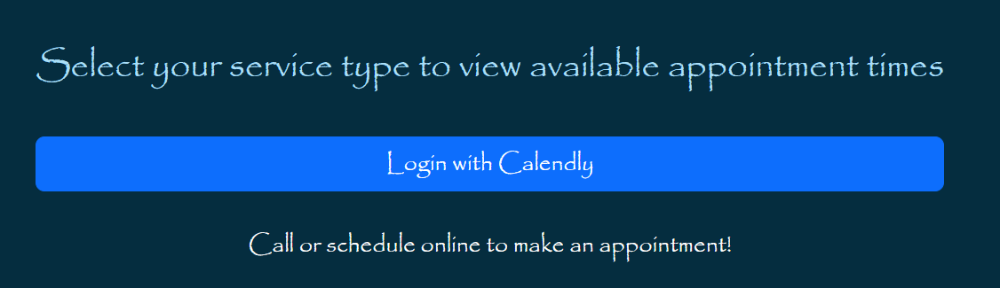
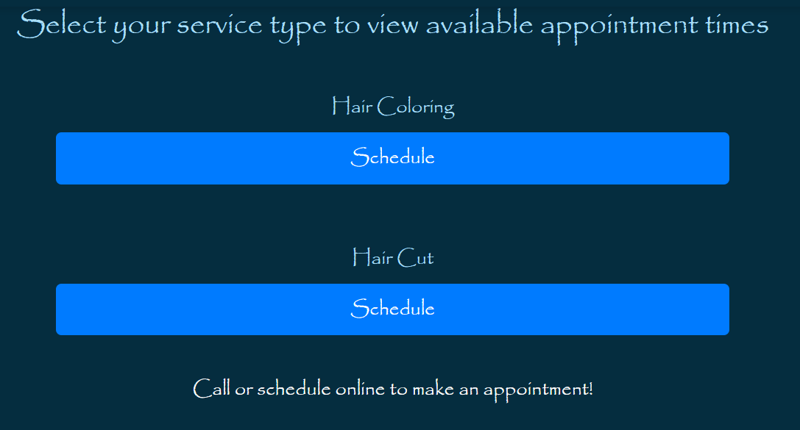
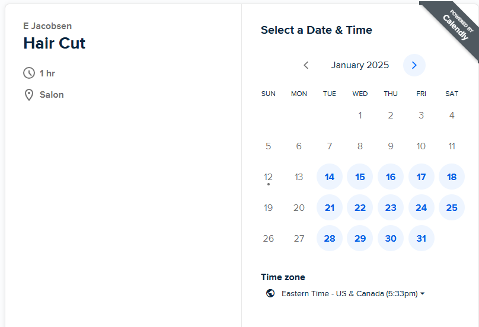

# New-Flow Salon Website
  
## Table of Contents
* [Description](#description)
* [License](#license)
* [Installation](#installation)
* [Usage](#usage)
* [Contributions](#contributions)
* [Contact Information](#contact-information)
* [Delployed Website](#deployed-website)
* [Additional Notes](#additional-notes)

## Description
New Flow, is proud to be a Latino-owned barbershop and beauty salon rooted in the heart of our community. Since opening our doors in 2009, our mission has been to blend tradition, culture, and creativity to bring out the best in everyone who walks through our doors. This is the main webpage for the business were the user can find shop information and schdule an appointment.

## License
This project is licensed with MIT

## Installation 
npm install

## Usage
### Pages
* [Home](#home)
* [About](#about)
* [Appointments](#appointments)
* [Log In](#log-in)
* [Sign Up](#sign-up)

### Home
From New Flow home page the user can select from the menu of page options, Home, About, Appointments, Login, and Sign Up

You can also create a post to make customers aware of current events or promotions

Access the Intagram page by clicking on the icon 

And you can change the language of the webpage between Spanish and English at the bottom of the page 

### About 
The About pages includes location information using an embedded Goodle Map, it also includes the salons mission statement and story.

### Appointments
To Make an appointment with the salon online, click the button to log into the Calendly calender magament service. 

Once logged in, a Web API will display the appointments types available. Select Your appointment type. 

Next you will be directed to Calendly on a new tab to select from the available times on the Salons Calender. 

### Log In
Ths log in page 

### Sign Up
The sign up page is our first step toward and employee login creation. Eventually this would be on a different pages entirely so that employee could eventually sign up, be authenticated and then be permitted to make posts on the main page for clients to see. The information that is inputted into the sign up is saved to our salon_db. 

## Contributions
Michael Mosquera, Khadijih Garcia, and Erin Jacobsen
 
## Contact Information
Michael Mosquera - My GitHub account is [GitHub Account Link](https://github.com/Mimosquera)
Khadijih Garcia - My GitHub account is [GitHub Account Link](https://github.com/KhadijihG)
Erin Jacobsen - My GitHub account is [GitHub Account Link](https://github.com/achensen)

## Delployed Website
Please follow this link for The New Flow Website : [Deployed Website]()

## Additional Notes 

